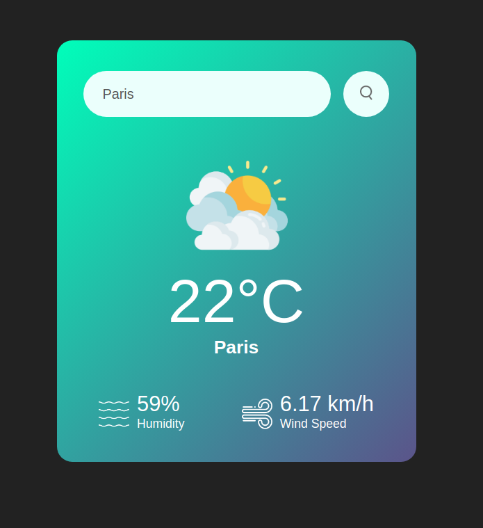

# Application météo en HTML/CSS et Javascript

## API utilisée | Open Weather

### App qui affiche des informations météorologique sur une ville à l'aide d'une barre de recherche

Lien de l'App : https://alexandre-longeaud.github.io/AppMeteoJavascript/

